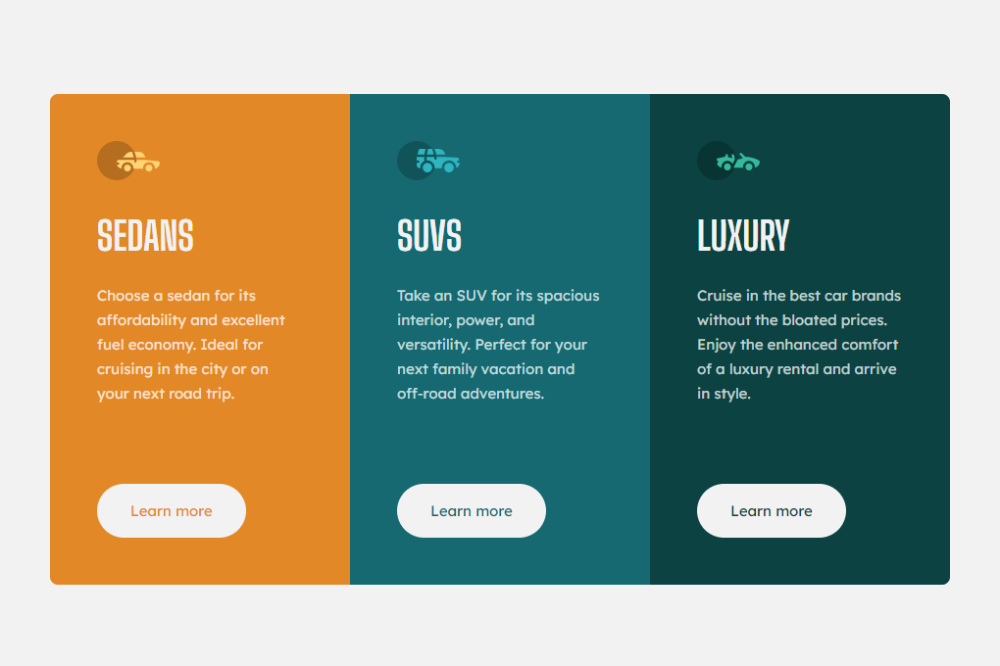

# Frontend Mentor - 3-column preview card component solution

This is a solution to the [3-column preview card component challenge on Frontend Mentor](https://www.frontendmentor.io/challenges/3column-preview-card-component-pH92eAR2-).

## Table of contents

- [Overview](#overview)
  - [The challenge](#the-challenge)
  - [Screenshot](#screenshot)
  - [Links](#links)
- [My process](#my-process)
  - [Built with](#built-with)
- [Author](#author)

## Overview

### The challenge

Users should be able to:

- View the optimal layout depending on their device's screen size
- See hover states for interactive elements

### Screenshot

### Links

- Solution URL: [https://github.com/ferfalcon/3-column-preview-card-component-main](https://github.com/ferfalcon/3-column-preview-card-component-main/)
- Live Site URL: [https://ferfalcon.github.io/3-column-preview-card-component-main](https://ferfalcon.github.io/3-column-preview-card-component-main/)

## My process

### Built with

- Semantic HTML5 markup
- CSS custom properties
- Flexbox
- CSS Grid
- CSS Nesting
- Mobile-first workflow

## Author

- LinkedIn - [Fernando Falcon](https://www.linkedin.com/in/fernandofalcon/)
- Frontend Mentor - [@ferfalcon](https://www.frontendmentor.io/profile/ferfalcon/)
- Website - [ferfalcon.com](http://ferfalcon.com/)
- Twitter - [@fernandofalcon](https://www.twitter.com/fernandofalcon/)